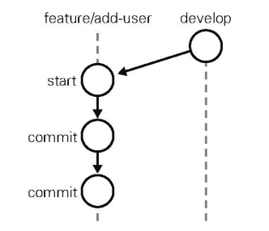
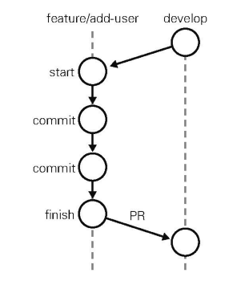
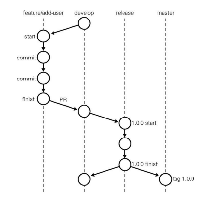
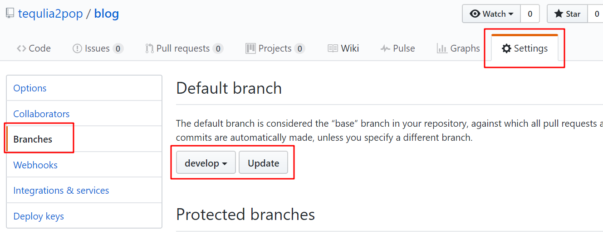
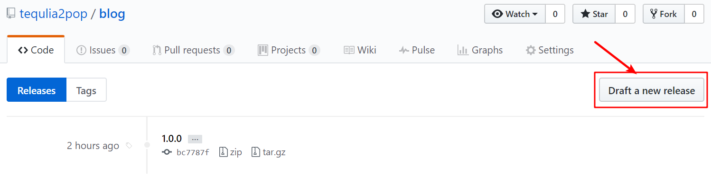
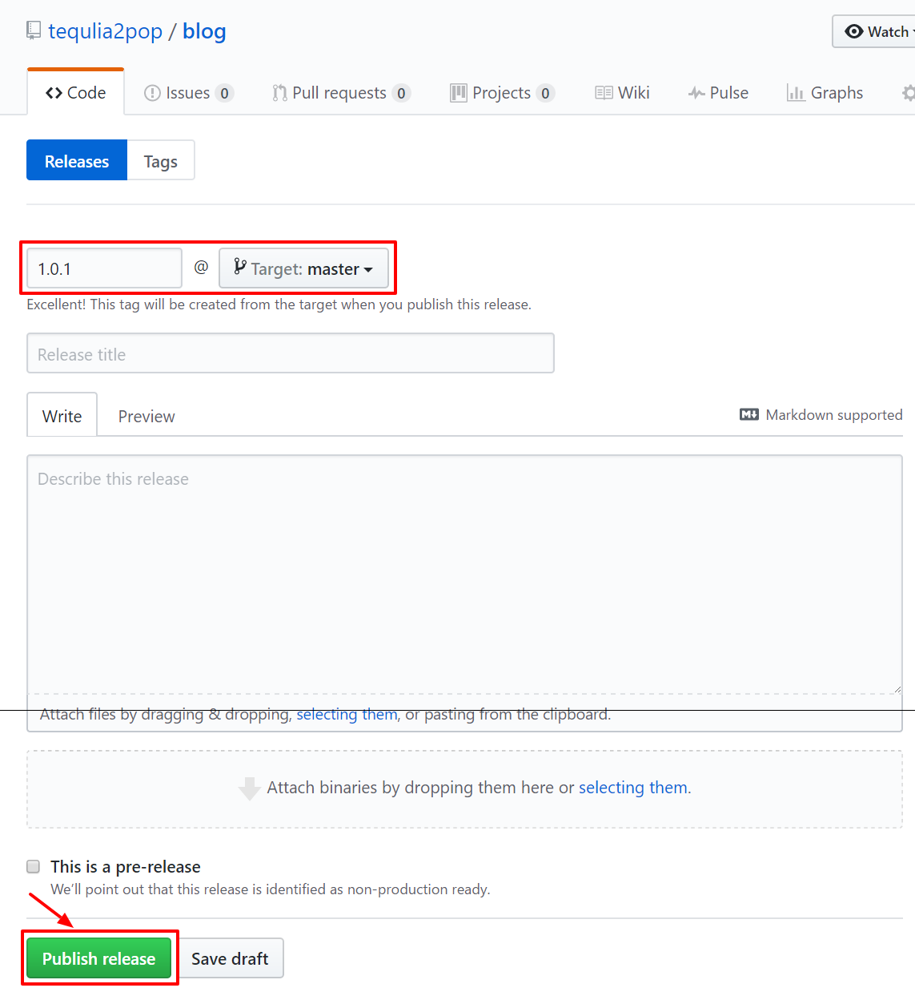
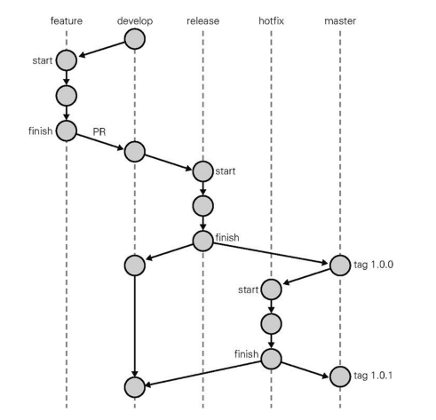

# Git Flow 实战

参考:《Github 入门与实践》

## 仓库的初始设置

假设正在开发博客软件。

1.  在 Github 上创建一个附带 README.md 文件的名为 blog 的仓库。

2.  将这个仓库 clone 到本地开发环境。

	```
	$ git clone git@github.com:hirocaster/blog.git
	```
   
3.  进行 git flow 的初始设置。这会自动创建并切换到用于开发的 develop 分支上。

	```
	$ cd blog
	$ git flow init -d
	$ git branch -a
	```
   
4.  在远程仓库中也创建 develop 分支。

	```
	$ git push -u origin develop
	$ git branch -a
	```

## 在 feature 分支中进行工作

假设要给软件实现一个添加用户的功能。

1.  将 develop 分支更新到最新状态。

	```
	$ git checkout develop
	$ git pull
	```

2.  创建 feature 分支 add-user，用来实现添加用户的功能。

	```
	$ git flow feature start add-user
	```

3.  在 feature/add-user 分支中实现目标功能并进行提交。

当前的状态如图所示：



## 发送 Pull Request

1.  将 feature/add-user 分支 push 到 Github 端远程仓库。

	```
	$ git push origin feature/add-user
	```
   
    注意，在 push 之前，应该做到：
   
    1. 通过 pull 操作获取 add-user 分支的最新代码；
   
    2. 先获取最新 develop 分支。
   
2.  打开 Github 的仓库页面，切换到 feature/add-user 分支，查看 develop 分支和 feature/add-user 分支的差别，然后创建并发送一个 Pull Request。

此时的状态如图所示：



## 通过代码审查提高代码质量

发送 Pull Request 之后，通过下列步骤利用 Pull Request 从其他开发者那里获取反馈，不断精炼代码。

1.  由其他开发者进行代码审查，在 Pull Request 中提供反馈。

2.  修正代码以反映反馈内容（在本地 feature/add-user 分支中）。

3.  将 feature/add-user 分支 push 到远程仓库（自动添加至之前的 Pull Request）。

4.  重复前三步。

5.  确认 Pull Request 没有问题后，由其他开发者将其合并到 develop 分支。

下面是几个反馈的要点：

*   没有测试，或者测试未通过。

*   违反编码规则。

*   代码品质过低（命名不明确，方法冗长等）。

*   还有重构的余地。

*   有重复部分。

## 更新本地的 develop 分支

我们发送的 Pull Request 在 Github 端与 develop 合并后，我们还要让本地的 develop 分支从 Github 端仓库获取最新状态。

```
$ git checkout develop
$ git pull
```

每当需要从 develop 分支创建 feature 等分支时，记得一定要先执行上述操作，保证 develop 分支处于最新状态。

在实际开发中，我们会不断重复之前这一系列流程，不断为 develop 分支添加功能。当功能积攒到足以发布时，就会用到 release 分支。

## 在 release 分支中进行工作

现在假设我们已经通过 feature 分支为 develop 分支添加了数个功能，软件进入了发布阶段。

1.  基于 develop 分支创建一个 release 分支。

	```
	$ git checkout develop
	$ git pull
	$ git flow release start '1.0.0'
	Switched to a new branch 'release/1.0.0'

	Summary of actions:
	- A new branch 'release/1.0.0' was created, based on 'develop'
	- You are now on branch 'release/1.0.0'

	Follow-up actions:
	- Bump the version number now!
	- Start committing last-minute fixes in preparing your release
	- When done, run:

		git flow release finish '1.0.0'
	```
   
2.  在 release 分支中处理与发布前准备相关的提交，比如版本编号变更等元数据的添加工作。如果软件部署到预演环境后出现 BUG，相关的修正也要提交给这个分支。

    注意，该分支绝对不可以包含需求变更或功能变更等重大修改。这一阶段的提交数应该限制到最低。

3.  进行发布与合并。这里会将 release 分支合并至 master 分支，然后为合并后的 master 分支加入一个与版本号相同编号的标签，然后将 release 分支合并至 develop 分支，最后删除本地的 release 分支。

    ```
    $ git flow release finish '1.0.0'
    Switched to branch 'master'
	Your branch is up-to-date with 'origin/master'.
	Merge made by the 'recursive' strategy.
	 add-user-1 | 0
	 add-user-2 | 0
	 release    | 0
	 3 files changed, 0 insertions(+), 0 deletions(-)
	 create mode 100644 add-user-1
	 create mode 100644 add-user-2
	 create mode 100644 release
	Already on 'master'
	Your branch is ahead of 'origin/master' by 9 commits.
	  (use "git push" to publish your local commits)
	Switched to branch 'develop'
	Your branch is up-to-date with 'origin/develop'.
	Merge made by the 'recursive' strategy.
	 release | 0
	 1 file changed, 0 insertions(+), 0 deletions(-)
	 create mode 100644 release
	Deleted branch release/1.0.0 (was 7c02ef8).

	Summary of actions:
	- Release branch 'release/1.0.0' has been merged into 'master'
	- The release was tagged '1.0.0'
	- Release tag '1.0.0' has been back-merged into 'develop'
	- Release branch 'release/1.0.0' has been locally deleted
	- You are now on branch 'develop'
    ```

当前的状态如图所示：



**设置 Github 的默认分支**

如果每次发送 Pull Request 时都要从 master 分支手动切换到 develop 分支，显然容易出现操作失误。因此，我们可以更改 Github 的仓库设置，指定 develop 分支为发送 Pull Request 时的默认分支。



## 更新到远程仓库

至此我们对多个分支进行了修改，所以需要利用 push 操作将修改更新到 Github 端的远程仓库。

1.  更新 develop 分支。

	```
	$ git push origin develop
	```

2.  更新 master 分支。	
	
	```
	$ git checkout master
	$ git push origin master
	```

3.  更新标签信息。

	```
	$ git push --tags
	```

## 在 hotfix 分支中进行工作

1.  将远程仓库的最新信息获取到本地，确认标签的版本编号是否有误。

	```
	$ git fetch origin
	```
	
2.  以 master 分支为起点，创建 hotfix/1.0.1 分支。

	```
	$ git flow hotfix start '1.0.1' master
	Switched to a new branch 'hotfix/1.0.1'

	Summary of actions:
	- A new branch 'hotfix/1.0.1' was created, based on 'master'
	- You are now on branch 'hotfix/1.0.1'

	Follow-up actions:
	- Start committing your hot fixes
	- Bump the version number now!
	- When done, run:

		 git flow hotfix finish '1.0.1'
	```
	
3.  在 hotfix/1.0.1 中修复软件的漏洞并提交。

4.  修复工作结束后，将 hotfix 分支 push 到 Github 端远程仓库，并向 master 分支发送 Pull Request。

	```
	$ git push origin hotfix/1.0.1
	```
	
5.  创建标签和进行发布。

	假设我们发送的 Pull Request 经过了其他开发者的审查，并且已经与 master 分支合并，现在就该利用 Github 的功能创建 1.0.1 的标签了。
	
	
	
	
	
6.  将 hotfix 分支合并至 develop 分支。

	从 hotfix/1.0.1 分支向 develop 分支发送 pull Request 即可。经过其他开发者的审查后，修改内容便会合并到 develop 分支。
	
	hotfix 分支与 master 分支和 develop 分支合并之后即完成了使命，可以被删除。
	
至此，分支迁移如下图所示：

