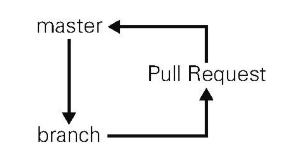
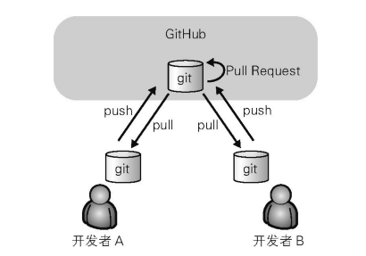

# Github Flow 简介

Github Flow 是 Github 公司正在实践的一个十分简单的开发流程。

参考：https://zachholman.com/talk/how-github-uses-github-to-build-github/

它是一个以部署为中心的开发流程。在实际开发中往往1天之内会实施几十次部署，而支撑这一切的就是足够简单的开发流程以及完全的自动化。

在 Github 公司，大致会让15至20人组成团队，利用这一流程进行同一项目的开发。

参考：http://scottchacon.com/2011/08/31/github-flow.html

## Github Flow 的开发流程

使用 Github Flow 的开发流程大致如下：

1.  令 master 分支时常保持在可以部署的状态。

    这一流程要以小时甚至分钟为单位持续地进行部署，所以不存在发布的概念。

2.  进行新的作业时要从 master 分支创建新分支，新分支名称要具有描述性。

    由于 master 分支时常保持着可以部署的状态，所以开发者可以随时从 master 分支创建新的分支。

	所谓描述性的名称，是指该名称能直观正确地表达这个分支的特性，比如：user-content-cache-key、submodules-init-task、redis2-transition。
   
    查看 Github 的分支列表页面（http://github.com/用户名/branches ）可以轻松掌握各分支与 master 分支的差别。

3.  在 2 新建的本地仓库分支中进行提交。

    绝对不要进行与该分支工作内容无关的修改。
   
    开发者还应该有意识地减小提交的规模。

4.  在 Github 端仓库创建同名分支，定期 push。

    这样一来不仅可以备份代码，还会定期给开发者团队创建交流的机会。

5.  需要帮助或反馈时创建 Pull Request，以 Pull Request 进行交流。

    尽早地创建 Pull Request 让其他开发者进行审查，以便听取反馈一边编写代码，没必要等到与 master 分支合并时再进行。

6.  让其他开发者审查，确认作业完成后与 master 分支合并。

    一个分支的作业结束后，需要注明作业已完成，让其他开发者进行审查。
   
    审查之后如果认为可以与 master 分支合并，则需要明确告知对方。按照 Github 的文化，这里会用到 “:+1:” 或 “:shipit:” 等表情，偶尔也会见到 LGTM 的字样（Looks good to me 的简写）。

7.  与 master 分支合并后立刻部署。

    代码合并到 master 分支并且通过所有自动测试之后，需要立刻进行部署。

## 使用 Github Flow 的前提条件

*   部署作业完全自动化

*   重视测试

    * 测试自动化
  
    * 编写测试代码，通过全部测试
  
    * 维护测试代码
  
## 团队实现 Github Flow 的几点建议

*   减小 Pull Request 的体积

*   准备可供试运行的环境

*   不要让 Pull Request 中有太多反馈

*   不要积攒 Pull Request

## 团队使用 Github 的注意事项

### 一切从简

Github 的各项功能都非常简单，因为在实际的软件开发中，往往用不到那些复杂度极高的功能。

**项目管理工具与 Github 的区别**

项目管理工具是以管理项目为目的的；而 Github 是为软件开发者提供支持的工具，它更注重辅助开发者高速开发高品质软件。要知道，往往事物越是简单，人们实施起来就越快。

Github 的简单功能，完全能够应对软件开发中的需要。想让团队最大限度发挥实力，建议剔除复杂规则，只以最简单的规则进行开发。

### 不 Fork 仓库的方法

在公开软件开发中，为了防止仓库收到计划之外的提交，通常使用下述流程：

1.   在 Github 上进行 Fork。

2.   将 1 的仓库 clone 至本地开发环境。

3.   在本地开发环境创建特性分支。

4.   对特性分支进行代码修改并进行提交。

5.   将特性分支 push 到 1 的仓库中。

6.   在 Github 上对 Fork 来源仓库发送 Pull Request。

在公司企业的开发中，通常不使用 Fork 仓库的工作流程。这种方法可以使每一个开发者都掌握着一个本地仓库和一个远程仓库，使整个开发流程变得简单。

